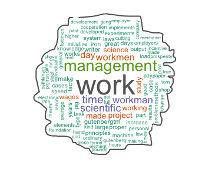

<!---->
#### The key idea about this app is to build and download quickly _word cloud_ for any file you are interested in.
 
 
 
**What is a Word cloud?** an image composed of words used in a particular text  or subject, in which the size of each word indicates its frequency or importance.

**Key differentiator:** You can also do analysis of 7 top frequencies.

##### Author:  
The app was created by Ambika J.  
Code @ <a href='https://github.com/studentcoursera/09_DDP_project_word_cloud_gen'target='_blank'>word_cloud_gen</a>  
Online app @ <a href='https://neo-r-apps.shinyapps.io/word_cloud_gen' target='_blank'>word_cloud_gen</a>  
